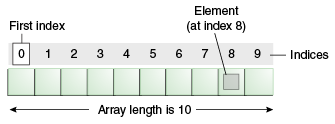

# W02 - D01 - Arrays and Functions
***made by [Valen](https://github.com/smgvalen)*** <br/> <br/>

 - [Arrays](#arrays)
     - [Declaration](#declaration)
     - [Length](#length)
     - [Iteration](#iteration)
     - [Get element](#get-element)
     - [Change element](#change-element)
 - [Functions](#functions)


## Arrays
> Array is a ***data structure***, 
which is a *collection of variables* of the ***same type***.<br/>
Does ***NOT*** declare individual variables, <br/>
but it ***DOES*** represent individual variables.

> The length of an array is established when the array is created.




> Each item in an array is called an ***element***,
and each element is accessed by its numerical ***index***.
Numbering begins with 0.

****

### Declaration
```java
//type[] nameOfArray = new type[length of the array];

String[] myStringArray1 = new String[3]; 
String[] myStringArray2 = {"a", "b", "c"}; 
String[] myStringArray3 = new String[]{"a", "b", "c"};
```

****

### Length
> `nameOfArray.length` shows the total number of elements of an Array. <br/>

****

### Iteration
> How do you iterate through the elements of an array? <br/>
*(i.e. go through each element one by one)*

```java
For (int i = 0; i < array.length; i++) {
  System.out.println(array[i])
}
``` 
 
****

### Get element
> How to take out an element of an Array?

```java
String[] myStringArray = {"a", "b", "c"}; 

// Refer to the index of the element:
myStringArray[2] // gives back the element at the index 2
                 // which is "c" in this example

```

****

### Change element
> Change an element of an Array

```java
int[] x = new int[] {2, 4, 5, 6, 7};
x[0] = 3;   // the element at index 0 changed to 3 from 2


```

## Functions 
